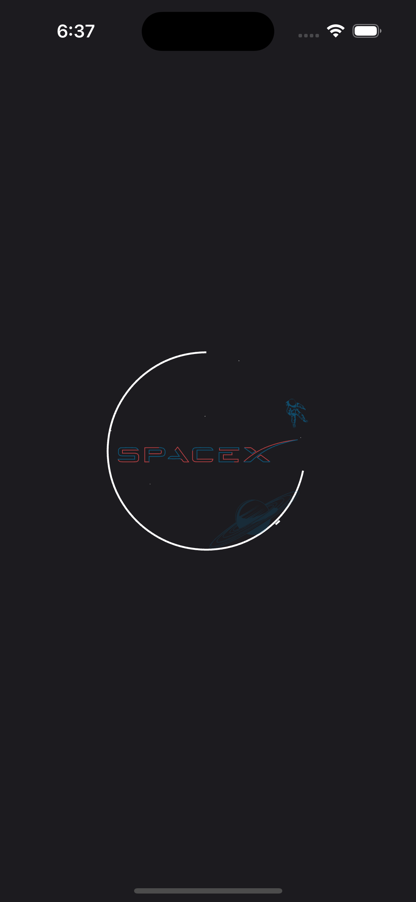
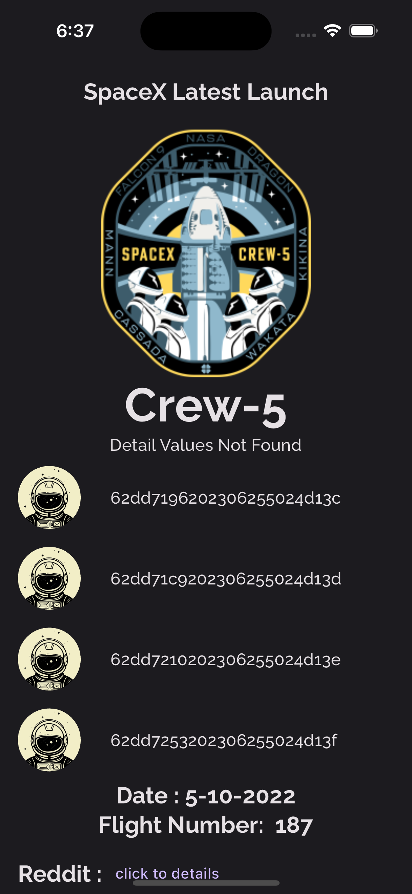
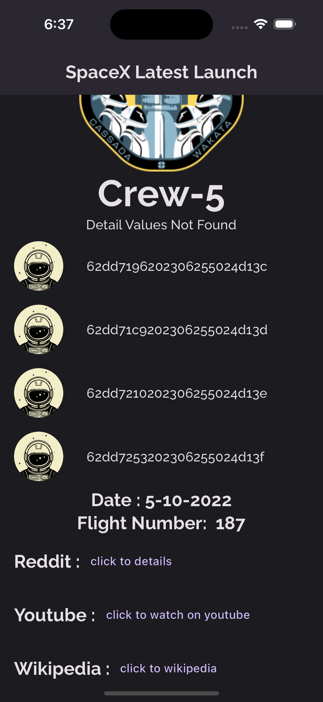

# SpaceX Flutter Uygulaması

API =>  [SpaceX Latest Launch API](https://api.spacexdata.com/v4/launches/latest) 

Bu Flutter uygulaması, SpaceX API'sinden veri çekerek uzay uçuşları ve mürettebat bilgilerini görüntülemek için tasarlanmıştır.

- [LinkedIn](https://www.linkedin.com/in/vural-kayra-cetintas/)
- [Github](https://github.com/vuralkayracetintas)

  

    
    
    
SplashScreen, Home

  

  

    

      
        
Home

    

  

##  Packages Used / Kullanılan Paketler
- [cupertino_icons](https://pub.dev/packages/cupertino_icons) (v1.0.2)
- [http](https://pub.dev/packages/http) (v1.1.0)
- [equatable](https://pub.dev/packages/equatable) (v2.0.5)
- [flutter_bloc](https://pub.dev/packages/flutter_bloc) (v8.1.3)
- [kartal](https://pub.dev/packages/kartal) (v3.2.0)
- [url_launcher](https://pub.dev/packages/url_launcher) (v6.1.12)
- [lottie](https://pub.dev/packages/lottie) (v2.6.0)
- [google_fonts](https://pub.dev/packages/google_fonts) (v5.1.0)

